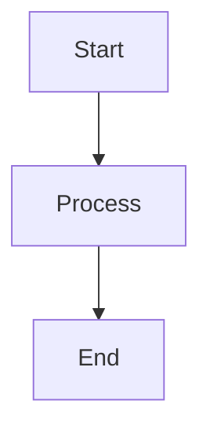

# 📝 Obsidian Workflow Guide

Hướng dẫn sử dụng Obsidian để viết và publish bài viết lên website portfolio.

## 🚀 Quick Start

### 1. Copy Files từ Obsidian

**Cách 1: Copy vào `/src/content/blog/` (Recommended)**
```
1. Mở Obsidian vault của bạn
2. Copy file .md từ Obsidian
3. Paste vào: src/content/blog/
4. Website tự động detect và publish!
```

**Cách 2: Copy vào `/src/site/notes/` (Existing structure)**
```
1. Copy file .md vào: src/site/notes/[folder]/
2. File sẽ được xử lý như note thông thường
```

### 2. Frontmatter Format

Website hỗ trợ **cả YAML và JSON** frontmatter từ Obsidian:

#### YAML Format (Recommended)
```yaml
---
title: "Tên Bài Viết"
date: 2024-12-15
tags: 
  - Data Analysis
  - SQL
  - Python
description: "Mô tả ngắn về bài viết"
image: "/img/cover-image.png"
technology:
  - SQL
  - Python
tool:
  - Tableau
category: "Business Analysis"
dg-publish: true
---
```

#### JSON Format (Obsidian default)
```json
---
{
  "title": "Tên Bài Viết",
  "date": "2024-12-15",
  "tags": ["Data Analysis", "SQL"],
  "description": "Mô tả ngắn",
  "dg-publish": true
}
---
```

### 3. Auto-Extracted Fields

Website tự động extract các fields sau nếu không có trong frontmatter:

- **title**: Từ filename nếu không có
- **date**: Từ `created`, `file-ctime`, hoặc file creation time
- **updated**: Từ `modified`, `file-mtime`, hoặc file modification time
- **description**: Từ đoạn đầu tiên của content (auto-truncate 160 chars)
- **tags**: Tự động normalize thành array

## 📋 Supported Obsidian Features

### ✅ Callouts

Website hỗ trợ đầy đủ Obsidian callouts:

```markdown
> [!info] Information
> Đây là callout info

> [!warning] Warning
> Cảnh báo quan trọng

> [!tip] Tip
> Mẹo hữu ích

> [!note] Note
> Ghi chú

> [!success] Success
> Thành công!

> [!error] Error
> Lỗi xảy ra

> [!question] Question
> Câu hỏi

> [!abstract] Abstract
> Tóm tắt
```

**Collapsible Callouts:**
```markdown
> [!info]+ Expanded by default
> Nội dung mở rộng

> [!info]- Collapsed by default
> Nội dung thu gọn
```

### ✅ Code Blocks với Copy Button

Code blocks tự động có copy button:

````markdown
```sql
SELECT * FROM users WHERE active = 1;
```

```python
def analyze_data(df):
    return df.describe()
```

```dax
Total Sales = SUM(Sales[Amount])
```
````

**Supported Languages:**
- SQL, Python, DAX, R, JavaScript, TypeScript
- Và tất cả languages được Prism.js support

### ✅ Images

**Obsidian Format:**
```markdown
![[image.png]]
```

**Web Format (tự động convert):**
```markdown

```

**Image Paths:**
- Obsidian: `attachments/image.png` → Web: `/img/image.png`
- Copy images vào: `src/site/img/` hoặc `src/content/blog/`

### ✅ Wiki Links

```markdown
[[Tên Note Khác]]
[[Tên Note|Custom Link Text]]
```

### ✅ Tags

```markdown
#data-analysis #sql #python
```

### ✅ Math (LaTeX)

```markdown
Inline: $E = mc^2$

Block:
$$
P(A|B) = \frac{P(B|A) \cdot P(A)}{P(B)}
$$
```

### ✅ Mermaid Diagrams

````markdown

````

## 📁 Project Structure

### Project Detail Pages

Để tạo project detail page, thêm frontmatter:

```yaml
---
title: "Project Name"
tags: ["project", "data-analysis"]
layout: "project"
technology: ["SQL", "Python"]
category: "Business Analysis"
roi: "150%"
cir_improvement: "25%"
---
```

**Content Structure:**
```markdown
## Problem / Vấn đề
Mô tả vấn đề cần giải quyết...

## Solution / Giải pháp
Mô tả giải pháp đã implement...

## Impact / Kết quả
- ROI: 150%
- CIR Improvement: 25%
- Metrics khác...
```

## 🎨 Frontmatter Fields Reference

### Required Fields
- `title`: Tiêu đề bài viết
- `date`: Ngày đăng (YYYY-MM-DD)

### Optional Fields
- `tags`: Array các tags
- `description`: Mô tả ngắn (SEO)
- `image` / `thumbnail` / `cover`: Ảnh cover
- `technology`: Tech stack (array)
- `tool`: Tools sử dụng (array)
- `category`: Category
- `dg-publish`: `true` để publish, `false` để draft
- `roi`: ROI của project (cho project pages)
- `cir_improvement`: CIR improvement (cho project pages)

### Auto-Generated Fields
- `permalink`: Tự động từ title
- `updated`: Từ file modification time
- `description`: Từ content nếu không có

## 📂 File Organization

### Recommended Structure

```
src/
├── content/
│   └── blog/              # Copy Obsidian files here
│       ├── post-1.md
│       ├── post-2.md
│       └── projects/
│           └── project-1.md
│
└── site/
    ├── notes/             # Existing notes (vẫn hoạt động)
    └── img/               # Images
        └── [your-images]
```

## 🔄 Workflow Steps

1. **Viết trong Obsidian**
   - Sử dụng tất cả features của Obsidian
   - Thêm frontmatter với YAML hoặc JSON

2. **Copy File**
   - Copy file .md từ Obsidian vault
   - Paste vào `src/content/blog/`

3. **Copy Images** (nếu có)
   - Copy images từ `attachments/` trong Obsidian
   - Paste vào `src/site/img/`
   - Update image paths trong markdown nếu cần

4. **Build & Deploy**
   ```bash
   npm run build
   ```
   Website tự động:
   - Extract frontmatter
   - Process markdown
   - Generate pages
   - Optimize images

## 💡 Tips

### Tip 1: Batch Import
Copy nhiều files cùng lúc từ Obsidian vào `src/content/blog/`

### Tip 2: Image Organization
Tạo folder structure trong `src/site/img/`:
```
img/
├── blog/
│   ├── post-1/
│   └── post-2/
└── projects/
    └── project-1/
```

### Tip 3: Frontmatter Template
Tạo template trong Obsidian:
```yaml
---
title: "{{title}}"
date: {{date:YYYY-MM-DD}}
tags: []
description: ""
image: ""
dg-publish: true
---
```

### Tip 4: Auto-Description
Nếu không có `description`, website tự động lấy từ đoạn đầu content. Đảm bảo đoạn đầu có nội dung hay!

## 🐛 Troubleshooting

### Images không hiển thị
- Check path: Obsidian `attachments/` → Web `/img/`
- Đảm bảo file image đã copy vào `src/site/img/`

### Frontmatter không được nhận
- Check format: YAML hoặc JSON đều được
- Đảm bảo có `---` ở đầu và cuối
- Check encoding: UTF-8

### Callouts không render
- Đảm bảo format: `> [!type] Title`
- Check có space sau `>`

### Code không highlight
- Check language tag: ` ```sql`, ` ```python`, etc.
- Prism.js sẽ auto-detect nếu có language tag

## 📚 Examples

Xem các file mẫu trong:
- `src/site/notes/` - Existing examples
- `src/content/blog/` - New blog posts (sau khi copy)

---

**Happy Writing! 🚀**
